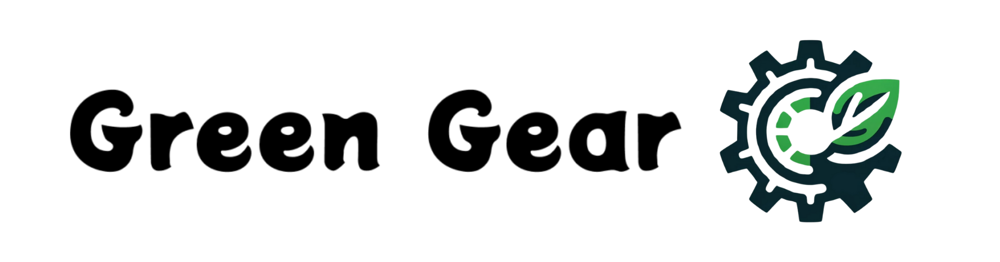

# Green Gear

  
Table des matiers

  <ol>
    <li>
      <a href="#description">Description</a>
    </li>
    <li>
      <a href="#composants-du-projet">Composants du projet</a>
      <ul>
        <li><a href="#application-mobile">Application Mobile</a></li>
        <li><a href="#api">API</a></li>
        <li><a href="#zeus:-hub">Zeus: Hub</a></li>
        <li><a href="#Poseidon:-premier-capteur">Poseidon: premier capteur</a></li>
      </ul>
    </li>
    <li><a href="#auteurs">Auteurs</a></li>
    <li><a href="#Documentations">Documentations</a></li>
  </ol>

## Description

Le projet `Green Gear` vise à révolutionner la gestion et la productivité des jardins à travers l'utilisation de la technologie domotique. En combinant une application mobile, une API, un boîtier de gestion domotique, et un capteur, `Green Gear` offre une solution intégrée pour optimiser l'entretien et le suivi des jardins. Ce projet de fin d'étude est conçu pour aider les utilisateurs à créer des environnements de jardinage plus efficaces, tout en étant respectueux de l'environnement.

## Composants du projet

###  Application Mobile

L'application mobile `Green Gear` sert de centre de contrôle pour les utilisateurs. Elle permet une interaction directe avec le système domotique du jardin. Les fonctionnalités clés incluent:
* Surveillance en temps réel de l'état du jardin
* Réception des notifications d'alerte
* Configuration et ajustement des paramètres des capteurs et du boîtier de gestion
* Visualisation des données historiques et des tendances

###  API

L'API `Green Gear` facilite la communication entre l'application mobile, le boîtier de gestion domotique, et les capteurs. Elle assure une intégration fluide et sécurisée, permettant:
* La collecte et le stockage des données en temps réel
* L'accès aux données historiques pour analyse
* La mise à jour à distance du firmware des dispositifs
* L'intégration avec d'autres systèmes et applications de gestion de jardin

###  Zeus : Hub 

Le boîtier de gestion domotique, Zeus, est au cœur du système `Green Gear`. Il agit comme un hub central, connectant les capteurs du jardin à l'application mobile via l'API. Ses principales fonctionnalités sont:
* Envoi des Données à l'API
* Gestion des Statuts Intermédiaires des Capteurs

###  Poseidon : premier capteur

Le premier capteur, Poseidon, développé pour `Green Gear` est conçu pour monitorer des éléments vitaux du jardin, tels que:
* L'humidité du sol
* Les niveaux de lumière

Ce capteur transmet les données collectées au boîtier de gestion domotique, permettant une réaction rapide et appropriée pour maintenir l'environnement de jardin idéal.

## Auteurs

- Thomas Daniel [Linkedin](https://www.linkedin.com/in/thomas-daniel-607545203/)
- Sid-Ahmed Nouar [Linkedin](https://www.linkedin.com/in/sid-ahmed-nouar-4347b5159/)
- Lucas Ferreira Rechauchere [Linkedin](https://www.linkedin.com/in/lucas-rechauchere/)
- Artur Mocanu [Linkedin](https://www.linkedin.com/in/artur-mocanu-7bb6131aa/)

## Documentations

- [Application mobile](./mobile-front-end/README.md)
- [API](./GreenGearAPI/README.md)
- [Hub Zeus](./Hub_Zeus/README.md)
- [Capteur Poseidon](./Capteur_Poseidon/README.md)
